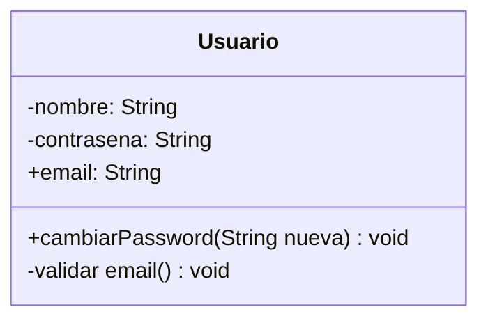
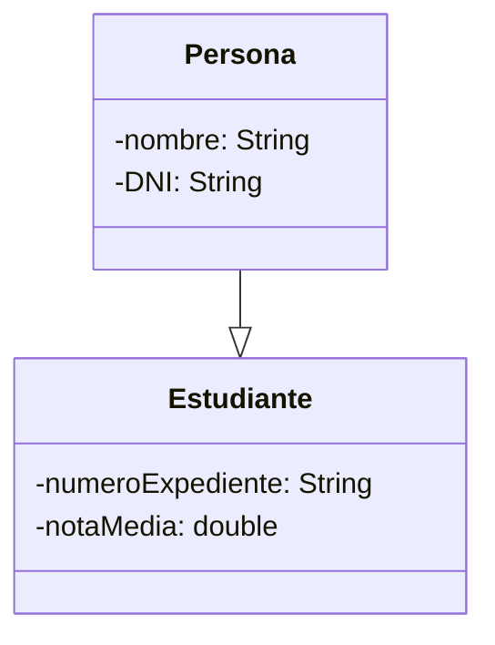
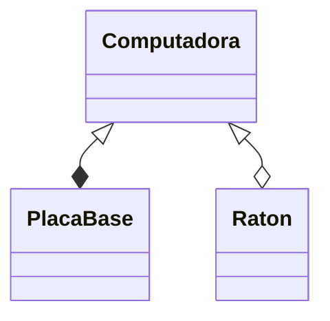

# 6.2.BateriaDeEjercicios
Repo para los ejercicios de diagrama de clases

# UML Ejercicio 1

```mermaid  
classDiagram 
direction TB
    class Usuario {
	    -nombre: String
	    -contrasena: String
	    +email: String
	    +cambiarPassword(String nueva) void
	    -validar email() void
    }
```

# UML Ejercicio 2

``` mermaid
classDiagram
direction TB
    class Persona {
	    -nombre: String
	    -DNI: String
    }

    class Estudiante {
	    -numeroExpediente: String
	    -notaMedia: double
    }

    Persona --|> Estudiante
```

#UML Ejercicio 3

```mermaid
classDiagram
direction TB
    class Computadora {
    }

    class PlacaBase {
    }

    class Raton {
    }

    Computadora <|--* PlacaBase
    Computadora <|--o Raton
```

